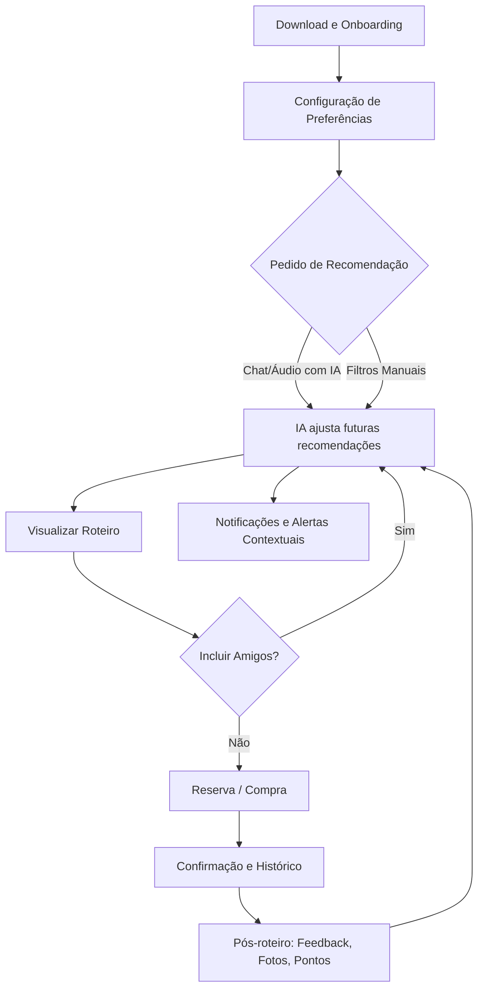

# 🗺️ Jornada do Usuário – UrbanXP

### 👤 Cenário:

Ana e seus amigos querem sair sexta à noite, mas ninguém sabe para onde ir. Eles usam o UrbanXP para criar um roteiro coletivo personalizado.

---

## **Etapa 1 – Onboarding e Configuração**

* Usuário baixa o app → cadastro rápido via e-mail, Google ou redes sociais.
* Configurações iniciais: preferências de lazer, tipos de experiências favoritas, localização habitual.
* Perfis de amigos previamente cadastrados podem ser adicionados a qualquer roteiro.

---

## **Etapa 2 – Pedido de Recomendação**

* **Chat/áudio com IA (linguagem natural):**

  > “Quero um roteiro sexta à noite com meus amigos: jantar + música ao vivo.”
* **Filtros manuais opcionais:** tipo de experiência, preço, distância, horário.
* Permite “pular” filtros manuais e obter recomendação direta da IA.

---

## **Etapa 3 – Processamento da IA**

* **Perfis individuais do grupo:** preferências, restrições alimentares, estilo musical, orçamento.
* **Contexto externo:** localização, clima, agenda cultural e disponibilidade de eventos locais (shows, feiras, campeonatos).
* IA combina todas essas informações e gera **roteiro otimizado** para o grupo.

---

## **Etapa 4 – Sugestões e Roteiros Inteligentes**

* Sugestões de lugares + eventos organizadas em sequência lógica (jantar → evento → after).
* Cada sugestão inclui: avaliações, preço médio, distância/tempo de deslocamento e link para reserva/ingresso.
* Usuário pode:

  * Ajustar manualmente o roteiro.
  * Convidar amigos para cálculo de compatibilidade de preferências.

---

## **Etapa 5 – Interação e Ajustes do Grupo**

* Chat/votação interna permite que cada amigo dê 👍 ou 👎 nas opções.
* IA recalcula e apresenta o **roteiro mais aceito pelo grupo** em tempo real.
* Destaques de eventos ou promoções patrocinadas podem ser inseridos sem interferir na escolha do roteiro.

---

## **Etapa 6 – Reserva e Compra**

* Clique em restaurante ou evento → redirecionamento ou integração direta com parceiros.
* Pagamento via app (Stripe, PayPal, Pagar.me).
* Confirmação automática registrada no histórico do usuário.

---

## **Etapa 7 – Experiência e Pós-roteiro**

* Check-in gamificado: pontos, badges e recompensas por presença.
* Feedback rápido pós-evento (“curtiram? sim/não”) para alimentar futuras recomendações.
* IA aprende preferências individuais e de grupo para melhorar roteiros futuros.

---

## **Etapa 8 – Notificações e Alertas Contextuais**

* Sugestões em tempo real baseadas em:

  * Localização atual
  * Clima
  * Eventos próximos
  * Promoções de parceiros

---

# ✨ Diferenciais Evidentes

1. **Curadoria contextual completa:** humor, clima, localização e preferências do grupo.
2. **Experiência coletiva:** multiusuário com votação integrada.
3. **Integração de eventos + restaurantes:** recomendações e reservas centralizadas.
4. **Ação completa:** recomendação → reserva/ingresso → check-in → feedback → aprendizado da IA.

---

## **Diagrama do Fluxo do Usuário – UrbanXP**

**Descrição:**

* O usuário realiza onboarding e configura preferências.
* Solicita recomendações via chat/áudio ou filtros manuais.
* IA gera roteiros inteligentes, com ajuste coletivo se houver multiusuário.
* Reservas e ingressos são processados e registrados.
* Pós-roteiro coleta feedback e pontos, alimentando futuras recomendações.
* Alertas contextuais mantêm engajamento contínuo.

